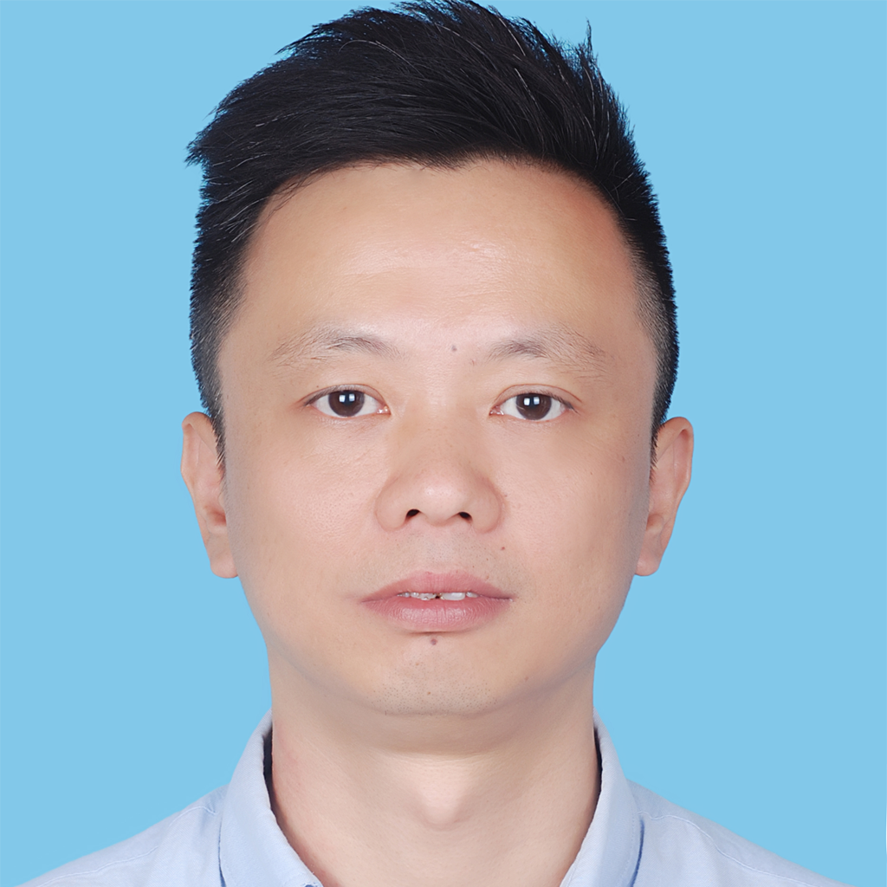

</img>

- Liu Zhen
- MaleSpecialty / Chengdu Electronics Technology
- Working period: 10 years
- Technical blog: https://github.com/kaindy7633/blog
- Expected positions: ADVANCED Web frontEnd engineer & Full Stack Web engineer ( Nodejs / Golang)
- Expected city: Chengdu / Remote Work
- Previous status: Resigned ( available at any time )

# Contact

- methodPhone : +86 18583360106
- Email：kaindy7633@gmail.com (3494688@qq.com)
- QQ / WeChat ID: 3494688/18583360106

## Descriptive

- Familiar with native HTML5/CSS3/JavaScript, ES6+, and its object-oriented, modular, design patterns and other features

- Familiar with ReactJS, Family Bucket (React-Router, Redux, Mobx), Hooks and SSR (Nextjs)

- Familiar with Vuejs2.x/3.x, Family Bucket (vue-router, vuex) and its SSR (Nuxtjs)

- Familiar with TypeScript and its application in React and Vue

- Familiar with developing H5, applet, native APP and GUI desktop application based on Taro and Electron

- Familiar with Nodejs Web, Golang Web development, and proficiently using Eggjs, Nestjs, Gin to develop CURD applications

- Familiar with Webpack project compilation tool and version management tool Git

- Familiar with the deployment, performance testing and exception monitoring of front-end projects under Linux (and front-end multi-service application deployment under Docker)

- Familiar with the continuous integration and release of front-end engineering, cluster load, multi-version coexistence and disaster recovery version rollback

- Familiar with the design, development and maintenance of the Web front-end architecture, as well as the design and application of the micro-front-end SINGE-SPA/QIANKUN architecture

- Possess a wealth of front-end team management experience, able to handle medium and large front-end team management positions, good at development process management, internal collaboration, career growth training, etc.

- Understand React Native and Flutter（learning）

# work experience

## Chengdu Wizard Cloud Technology Co., Ltd.

### Position:

Senior Web Front-end Engineer & Front-end Architect & Front-end Technical Supervisor (March 2020 ~ July 2021)

### Work content and performance:

1. Responsible for the front-end architecture design of the company's products, the construction and maintenance of the development environment, and the transformation and upgrade of the old system

2. Responsible for the formulation and implementation supervision of the front-end team development specifications, and the preparation of the development documents of each sub-category product

3. Develop a variety of low-level plug-ins applied to the company's business and deploy them to private warehouses to provide component-based development solutions for rapid iteration of multi-line businesses

4. Cooperate with product, back-end and operation and maintenance to formulate product development and release process, and participate in standardizing agile iterative development process

5. Lead the team to develop a bionic presentation system based on React+SVG, and derive an animation library based on SVG

6. Lead the team to develop customizable graph editing products based on AntV/X6 and G6 data-driven engines

7. Lead the team to quickly develop and deliver cross-terminal GUI desktop application products based on React + Electron

8. Develop a Web3D demonstration system based on Threejs based on business requirements

9. Responsible for front-end team technical management, daily work management, project process management, training promotion, etc.

## Chengdu Youke Xingkong Information Technology Co., Ltd. (Youke Yijia)

### Position:

Senior Web Front-end Engineer & Front-end Architect & Front-end Technical Supervisor (July 2018 ~ February 2020)

### Work content and performance:

1. Responsible for the front-end architecture design of the company's products, the construction and maintenance of the development environment, and the transformation and upgrade of the old system

2. Responsible for the formulation and implementation supervision of the front-end team development specifications, and the preparation of the development documents of each sub-category product

3. Develop the company's own UI library, Vue's common tool library and plug-ins according to UI specifications

4. Lead the team from ES (ECMAScript) to TS (TypeScript) development, laying a language foundation for building maintainable and extensible large-scale applications

5. Develop a variety of low-level plug-ins applied to the company's business and deploy them to private warehouses to provide componentized development solutions for rapid iteration of multi-line business

6. Cooperate with product, back-end and operation and maintenance to formulate product development and release process, and assist CTO to standardize agile iterative development process

7. Cooperate with products and test applications based on BDD-based software development and testing process

8. Complete the transformation of the old system and realize the complete separation of the front and back end development

9. Standardize front-end development and improve front-end team collaboration efficiency

10. Add the performance and exception monitoring of the production environment to the front end to improve the project's ability to handle boundary conditions in the production environment

11. Use Docker to build a multi-service cluster and its balanced load for front-end development and production environments

12. Build Jenkins-based automated deployment for front-end engineering and provide solutions for grayscale environment release

## Sichuan Pangu Medical Technology Co., Ltd.

### Position:

Senior Web Front-end Engineer & Front-end Supervisor (June 2016 ~ June 2018)

### Work content and performance:

1. Responsible for the front-end architecture design of the company's products and the establishment and maintenance of the development environment

2. Participate in designing the technical architecture of the company's products (based on RESTful)

3. Responsible for creating and maintaining the product UI framework (based on BootStrap)

4. Develop and maintain an AngularJS-based front-end component library according to business needs and UI design

5. Continue to optimize product experience, optimize product performance and compatibility in various browsers

6. Responsible for product front-end security testing and BUG repair

## Mianyang Zhanwang Technology Co., Ltd.

### Position:

Front-end Engineer (Web/PHP) (September 2012 ~ May 2016)

### Work content and performance:

1. Responsible for building the company's Internet cafe maintenance and management system

2. Use DIV+CSS to build front-end pages, and jQuery to achieve page effects

3. Use ThinkPHP v3.2.3 as the back-end development framework for project construction

4. Continue to optimize the front-end experience and page response speed, and iterate project functions according to business needs

## Beijing Brotherlian Education Technology Co., Ltd.

### Position:

Web/PHP engineer/student (January 2011 ~ August 2012)

### Work content and performance:

1. In-depth study of PHP related development and system operation and maintenance

2. Participate in the development of some outsourcing projects

# Education experience

## Nanodegree (online education)

Web front-end engineer (2015.01 –2015.11)

Learn the web front-end engineer training courses jointly produced by Silicon Valley, Google, Github and other companies. In-depth study of JavaScript object-oriented, website performance optimization, browser compilation principles, HTTP protocol and other courses.

## Chengdu University of Electronic Science and Technology Adult Education Institute

Computer Science and Technology (1997.9-2000.3)

---

# Thanks

Thank you for taking the time to read my resume, and I look forward to having the opportunity to work with you.
